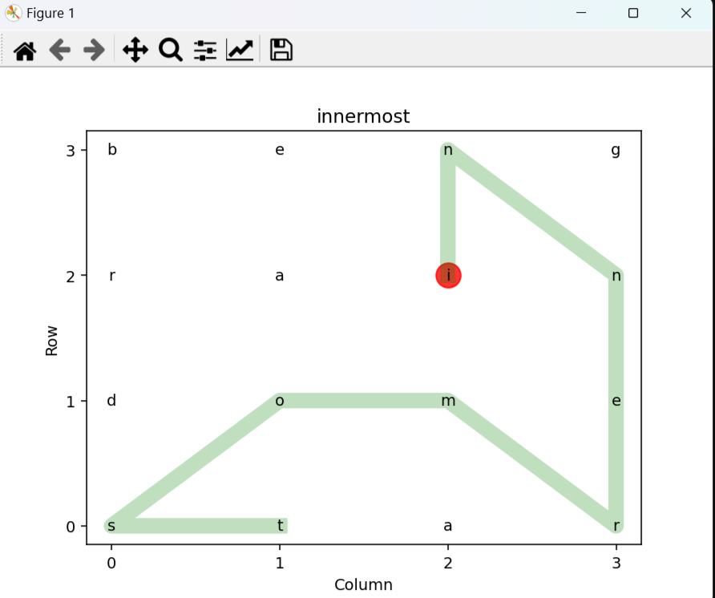

# DictionaryPySolver

**DictionaryPySolver** is a small collection of Python scripts designed to solve a specific problem about finding the longest word in a matrix grid.

It can also provide a nice visualization of the solution and a quick way of entering simple matrices without any setup or code at all, allowing for easy access to solutions at any time.



## The Problem

One is given a matrix of characters and has to find the longest English word that can be formed, by picking a starting point on the matrix and accumulating characters by moving in any direction (including diagonally) on the matrix. Hereby, each character may only be used once, and a dictionary of valid English words is provided.

## The Solutions

This project implements multiple ways of solving this problem, though only some are actually realistically usable, since others take an exorbitant amount of time to solve the problem, like the [naive Bruteforce approach](bruteforce_combinations.py).

The primary solution used by the [main.py](main.py) file, which also provides the primary UI, is the "frequency_search" approach, utilizing Python's [Counter object](https://docs.python.org/3/library/collections.html#collections.Counter) and a based on length presorted dictionary.

## Installation and Usage


### Using a Python Interpreter (Recommended)

1. Clone the git repository
    ```shell
    git clone https://github.com/DarthRevan333/DictionaryPySolver
    ```

2. Install [dependencies](requirements.txt)
    ```shell
    pip install -r DictionaryPySolver/requirements.txt
    ```

3. Run the project (automatically runs main.py file)[^1]
    ```shell
    python DictionaryPySolver
    ```

3. Enter your matrix as a string of characters
    ```
    > BENGRAINDOMESTAR 
            |
            |
            ↓    
    | ------------- |
    | B   E   N   G |
    | R   A   I   N |
    | D   O   M   E |
    | S   T   A   R |
    | ------------- |
    ```

[^1]: Alternatively one can also use the code in another Python script by importing any required names. Most code contains a (small) documentation and everything should have clear enough names to be easily understandable.

### Using the [PyInstaller](https://pypi.org/project/pyinstaller/) executable
1. Download the [executable from the releases section](https://github.com/DarthRevan333/DictionaryPySolver/releases/latest)

2. Run the executable

3. Enter your matrix as a string of characters:
    ```
    > BENGRAINDOMESTAR 
            |
            |
            ↓    
    | ------------- |
    | B   E   N   G |
    | R   A   I   N |
    | D   O   M   E |
    | S   T   A   R |
    | ------------- |
    ```

## License

This project is licensed under the MIT License. See the [LICENSE](LICENSE) file for details.